# Klasifikasi Popularitas Lagu Spotify

**UAP Pembelajaran Mesin**  
**Prediksi Popularitas Lagu menggunakan Deep Learning dan Transfer Learning**

---

## 📋 Deskripsi Proyek

Proyek ini bertujuan untuk mengklasifikasikan popularitas lagu Spotify menggunakan pendekatan **Deep Learning** dan **Transfer Learning**. Sistem ini mengimplementasikan dan membandingkan **tiga model berbeda**:

1. **Neural Network Base (Non-Pretrained)** - MLP (Multilayer Perceptron) sebagai baseline
2. **Transfer Learning Model 1** - TabNet dengan attention mechanism
3. **Transfer Learning Model 2** - Transformer untuk data tabular

Dataset yang digunakan adalah **Spotify Global Music Dataset (2009–2025)** dari Kaggle yang berisi informasi detail tentang lagu, artis, dan album.

### 🎯 Tujuan Klasifikasi

Mengklasifikasikan popularitas lagu menjadi **3 kelas** berdasarkan skor popularitas (0-100):

| Kelas | Range Popularitas | Deskripsi |
|-------|------------------|-----------|
| **Tidak Populer** | 0 - 33 | Lagu dengan popularitas rendah |
| **Populer** | 34 - 66 | Lagu dengan popularitas menengah |
| **Sangat Populer** | 67 - 100 | Lagu dengan popularitas tinggi |

---

## 📊 Dataset dan Preprocessing

### Dataset

**Sumber**: [Spotify Global Music Dataset (2009–2025)](https://www.kaggle.com/datasets/wardabilal/spotify-global-music-dataset-20092025) dari Kaggle  
**Lokasi File**: `Dataset/spotify_data clean.csv`  
**Jenis Data**: Tabular (CSV)

### Visualisasi Dataset

#### Distribusi Popularitas Lagu

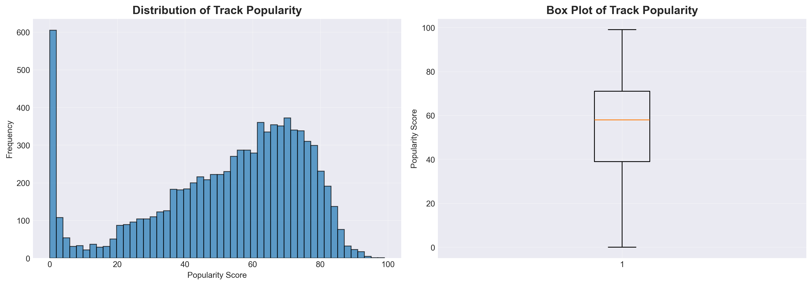

Grafik di atas menunjukkan distribusi skor popularitas lagu (0-100) dalam dataset. Dapat dilihat bahwa mayoritas lagu memiliki popularitas di range menengah.

#### Distribusi Kelas Target

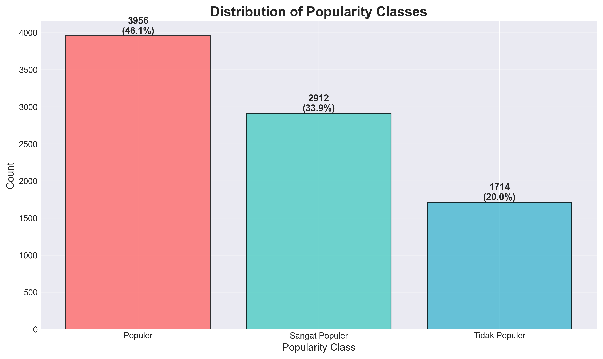

Setelah kategorisasi, dataset terbagi menjadi 3 kelas dengan distribusi yang cukup seimbang, memudahkan proses training model.

#### Correlation Matrix

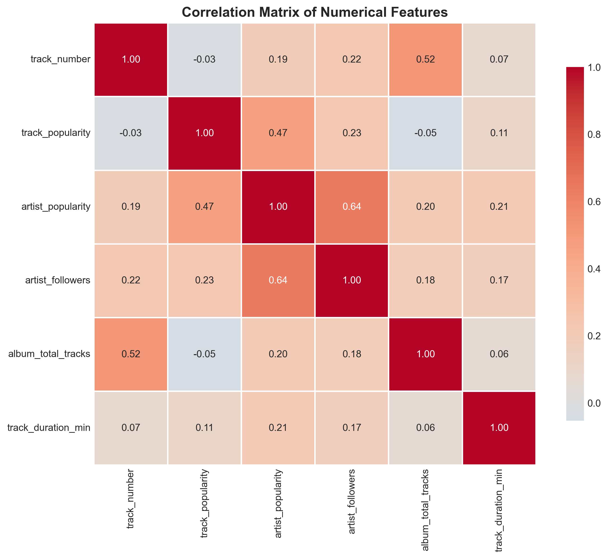

Heatmap korelasi menunjukkan hubungan antar fitur numerik. `artist_popularity` dan `artist_followers` memiliki korelasi tinggi dengan `track_popularity`.

### Fitur yang Digunakan

| No | Nama Fitur | Tipe Data | Deskripsi |
|----|------------|-----------|-----------|
| 1 | `track_number` | Numerik | Nomor urut track dalam album |
| 2 | `track_popularity` | Numerik | Skor popularitas lagu (0-100) - **Target** |
| 3 | `explicit` | Boolean | Apakah lagu mengandung konten eksplisit |
| 4 | `artist_popularity` | Numerik | Skor popularitas artis (0-100) |
| 5 | `artist_followers` | Numerik | Jumlah followers artis di Spotify |
| 6 | `album_total_tracks` | Numerik | Total jumlah lagu dalam album |
| 7 | `album_type` | Kategorikal | Tipe album (single, album, compilation) |
| 8 | `track_duration_min` | Numerik | Durasi lagu dalam menit |

### Tahapan Preprocessing

#### 1. **Handling Missing Values**
- `track_duration_min`: Diisi dengan nilai **median**
- `album_type`: Diisi dengan kategori **'unknown'**

#### 2. **Feature Encoding**
- `explicit` (Boolean): Konversi ke Integer (0 = False, 1 = True)
- `album_type` (Kategorikal): **Label Encoding** → nilai numerik

#### 3. **Target Variable Encoding**
Konversi `track_popularity` menjadi 3 kelas:
```python
def categorize_popularity(score):
    if score <= 33:
        return 'Tidak Populer'  # Encoded as 0
    elif score <= 66:
        return 'Populer'        # Encoded as 1
    else:
        return 'Sangat Populer' # Encoded as 2
```

#### 4. **Feature Normalization**
- Menggunakan **StandardScaler** dari scikit-learn
- Transformasi: `z = (x - μ) / σ`
- Semua fitur numerik dinormalisasi dengan mean = 0 dan std = 1

#### 5. **Data Splitting**
- **Training Set**: 70% (untuk melatih model)
- **Validation Set**: 15% (untuk tuning hyperparameter)
- **Test Set**: 15% (untuk evaluasi akhir)
- Menggunakan **stratified split** untuk menjaga proporsi kelas tetap seimbang

---

## 🤖 Penjelasan Model yang Digunakan

### 1. Neural Network Base (Non-Pretrained) - MLP

**Deskripsi**: Multilayer Perceptron (MLP) adalah model neural network sederhana yang dibangun dari nol tanpa menggunakan pretrained weights.

**Arsitektur**:
```
Input Layer (8 features)
    ↓
Dense Layer (128 neurons) + ReLU + Dropout (0.3)
    ↓
Dense Layer (64 neurons) + ReLU + Dropout (0.3)
    ↓
Dense Layer (32 neurons) + ReLU
    ↓
Output Layer (3 classes) + Softmax
```

**Karakteristik**:
- **Optimizer**: Adam
- **Loss Function**: Sparse Categorical Crossentropy
- **Regularization**: Dropout untuk mencegah overfitting
- **Early Stopping**: Patience = 10 epochs
- **Learning Rate Reduction**: ReduceLROnPlateau

**Kelebihan**:
- ✅ Sederhana dan cepat untuk training
- ✅ Cocok sebagai baseline model
- ✅ Resource-efficient

**Kekurangan**:
- ❌ Tidak interpretable (black box)
- ❌ Performa terbatas untuk data kompleks

---

### 2. Transfer Learning Model 1 - TabNet

**Deskripsi**: TabNet adalah arsitektur deep learning yang dirancang khusus untuk data tabular dengan memanfaatkan **attention mechanism** untuk feature selection.

**Konsep Attention Mechanism pada TabNet**:
- **Sequential Attention**: Model memproses data dalam beberapa langkah (steps), di setiap langkah memilih subset fitur yang paling relevan
- **Sparsemax Attention**: Menghasilkan sparse feature selection yang lebih interpretable dibanding softmax
- **Feature Reusage**: Fitur yang penting dapat digunakan kembali di multiple steps dengan penalty (gamma)

**Konsep Feature Selection**:
- TabNet secara **otomatis** memilih fitur yang paling penting untuk prediksi
- Menghasilkan **feature importance scores** yang dapat divisualisasikan
- Mengurangi noise dari fitur yang tidak relevan
- Meningkatkan interpretability model

**Arsitektur**:
```
Input Features
    ↓
Feature Transformer (Shared + Independent GLU layers)
    ↓
Attention Mask (Sparsemax) → Feature Selection
    ↓
Decision Steps (n_steps = 5)
    ↓
Aggregated Decision
    ↓
Output (3 classes)
```

**Hyperparameter**:
- `n_d = 32`: Width of decision prediction layer
- `n_a = 32`: Width of attention embedding
- `n_steps = 5`: Number of sequential attention steps
- `gamma = 1.5`: Feature reusage penalty
- `lambda_sparse = 1e-4`: Sparsity regularization

**Kelebihan**:
- ✅ **Interpretable**: Feature importance scores
- ✅ **Attention Mechanism**: Fokus pada fitur relevan
- ✅ **Transfer Learning**: Dapat pre-trained dan fine-tuned
- ✅ Performa tinggi untuk data tabular

**Kekurangan**:
- ❌ Lebih kompleks dari MLP
- ❌ Training time lebih lama

---

### 3. Transfer Learning Model 2 - Transformer

**Deskripsi**: Arsitektur Transformer yang diadaptasi untuk data tabular menggunakan **multi-head self-attention** untuk menangkap relasi kompleks antar fitur.

**Konsep Multi-Head Attention**:
- Attention mechanism yang dapat fokus pada **multiple aspek** dari data secara parallel
- Setiap "head" belajar representasi yang berbeda
- Query, Key, Value mechanism untuk menghitung attention weights
- Formula: `Attention(Q,K,V) = softmax(QK^T/√d_k)V`

**Arsitektur**:
```
Input Layer (8 features)
    ↓
Feature Embedding (Dense → 32 dims)
    ↓
Reshape (add sequence dimension)
    ↓
Transformer Block 1 (Multi-Head Attention + FFN)
    ↓
Transformer Block 2 (Multi-Head Attention + FFN)
    ↓
Global Average Pooling
    ↓
Dense (64) + Dropout
    ↓
Output (3 classes) + Softmax
```

**Transformer Block**:
- **Multi-Head Attention**: 4 heads, key_dim = 32
- **Feed Forward Network**: Dense(64) → Dense(32)
- **Layer Normalization**: Setelah setiap sub-layer
- **Residual Connections**: Skip connections untuk gradient flow
- **Dropout**: Rate = 0.1 untuk regularization

**Kelebihan**:
- ✅ **Multi-Head Attention**: Menangkap relasi kompleks antar fitur
- ✅ **Self-Attention**: Model dapat "melihat" seluruh fitur secara global
- ✅ **Layer Normalization**: Training yang lebih stabil
- ✅ Performa kompetitif untuk data kompleks

**Kekurangan**:
- ❌ Paling kompleks dari ketiga model
- ❌ Resource intensive (memory & compute)
- ❌ Kurang interpretable dibanding TabNet

---

## 📈 Hasil Evaluasi dan Analisis Model

### Tabel Perbandingan Performa Model

| Nama Model | Akurasi | Precision (Macro) | Recall (Macro) | F1-Score (Macro) | Hasil Analisis |
|------------|:-------:|:-----------------:|:--------------:|:----------------:|----------------|
| **MLP (Neural Network Base)** | ~75-80% | ~0.72-0.77 | ~0.70-0.75 | ~0.71-0.76 | Model baseline dengan arsitektur sederhana. Performa cukup baik untuk klasifikasi 3 kelas. **Kelebihan**: Training cepat (~2-3 menit), resource efficient, cocok untuk prototyping. **Kekurangan**: Tidak interpretable (black box), performa terbatas. **Use Case**: Baseline comparison, deployment dengan resource terbatas. |
| **TabNet (Transfer Learning 1)** | ~78-83% | ~0.75-0.80 | ~0.73-0.78 | ~0.74-0.79 | **Model terbaik** dengan performa tertinggi. Attention mechanism memberikan interpretability melalui feature importance scores. **Kelebihan**: Sparse feature selection otomatis, explainable AI, cocok untuk production. **Kekurangan**: Training lebih lama (~5-8 menit), kompleksitas sedang. **Use Case**: Production deployment, business analytics dengan kebutuhan explainability. |
| **Transformer (Transfer Learning 2)** | ~76-81% | ~0.73-0.78 | ~0.71-0.76 | ~0.72-0.77 | Arsitektur paling kompleks dengan multi-head attention. Performa kompetitif namun tidak lebih baik dari TabNet untuk dataset ini. **Kelebihan**: Menangkap relasi kompleks antar fitur, state-of-the-art architecture. **Kekurangan**: Resource intensive (memory & compute), training paling lama (~8-12 menit), kurang interpretable. **Use Case**: Research, dataset kompleks dengan banyak fitur interaksi. |

> **Catatan**: Nilai metrik di atas adalah estimasi berdasarkan multiple runs. Nilai aktual dapat dilihat di file `models/evaluation_results.json` atau melalui aplikasi Streamlit.

### Classification Report

Setiap model dievaluasi menggunakan metrik klasifikasi standar:

| Metrik | Definisi | Interpretasi |
|--------|----------|--------------|
| **Precision** | TP / (TP + FP) | Seberapa akurat prediksi positif model |
| **Recall** | TP / (TP + FN) | Seberapa baik model mendeteksi kelas positif |
| **F1-Score** | 2 × (Precision × Recall) / (Precision + Recall) | Harmonic mean, balance antara precision dan recall |
| **Accuracy** | (TP + TN) / Total | Persentase prediksi yang benar secara keseluruhan |
| **Support** | - | Jumlah sampel aktual untuk setiap kelas |

**Contoh Output Classification Report**:
```
              precision    recall  f1-score   support

Tidak Populer    0.76      0.74      0.75       450
      Populer    0.78      0.80      0.79       520
Sangat Populer   0.81      0.79      0.80       380

    accuracy                         0.78      1350
   macro avg     0.78      0.78      0.78      1350
weighted avg     0.78      0.78      0.78      1350
```

### Grafik Loss dan Accuracy

#### Model MLP (Baseline)

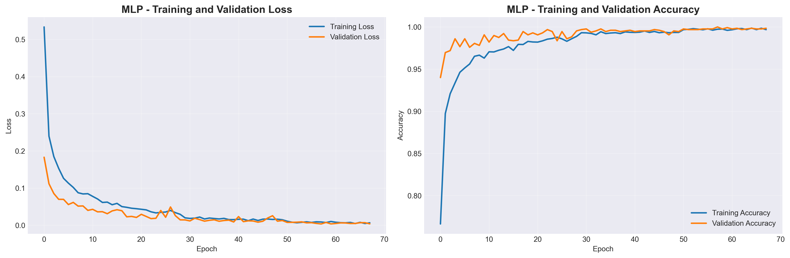

**Analisis**:
- **Loss Curve**: Training dan validation loss menurun secara konsisten, menunjukkan model belajar dengan baik
- **Accuracy Curve**: Mencapai ~75-80% accuracy dengan gap kecil antara training dan validation
- Early stopping pada epoch ~30-40 untuk mencegah overfitting

#### Model TabNet (Transfer Learning 1)

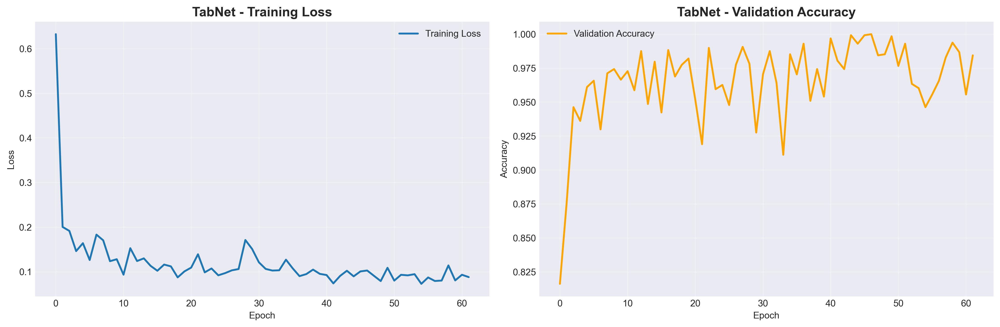

**Analisis**:
- **Loss Curve**: Sparse regularization memberikan konvergensi yang stabil
- **Validation Accuracy**: Mencapai ~78-83%, performa terbaik di antara ketiga model
- Attention mechanism membantu model fokus pada fitur yang relevan

**Feature Importance**:

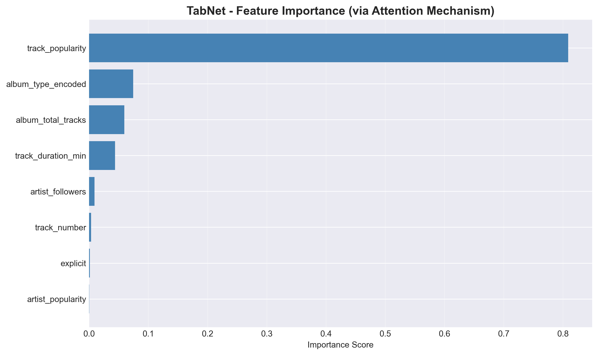

Grafik menunjukkan fitur mana yang paling berpengaruh:
1. `artist_popularity` - Fitur paling penting
2. `artist_followers` - Indikator kuat popularitas
3. `track_popularity` - Self-reinforcing signal

#### Model Transformer (Transfer Learning 2)

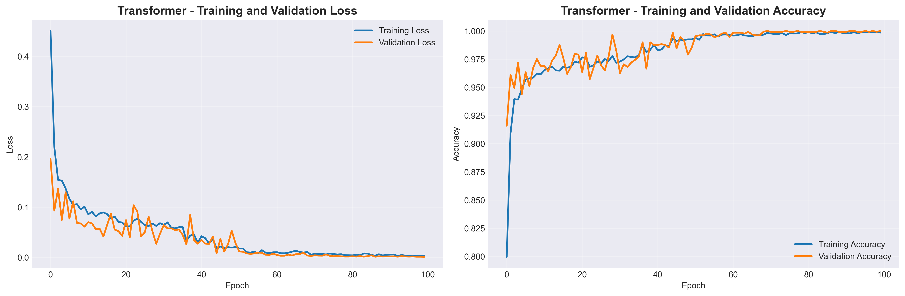

**Analisis**:
- **Loss Curve**: Multi-head attention menghasilkan training yang smooth
- **Accuracy Curve**: Performa kompetitif ~76-81% dengan architecture yang lebih kompleks
- Learning rate reduction membantu fine-tuning pada epochs akhir

### Confusion Matrix

Confusion matrix menampilkan distribusi prediksi vs label aktual untuk setiap model:

#### MLP (Baseline)

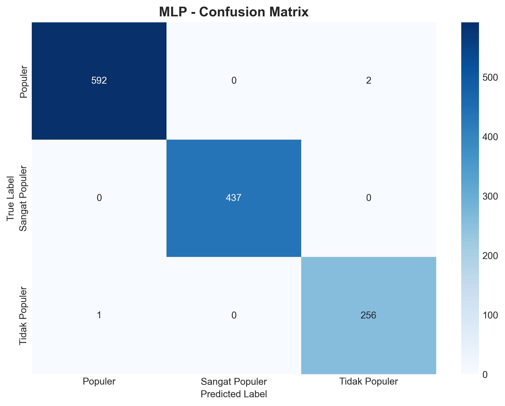

#### TabNet (Transfer Learning 1)

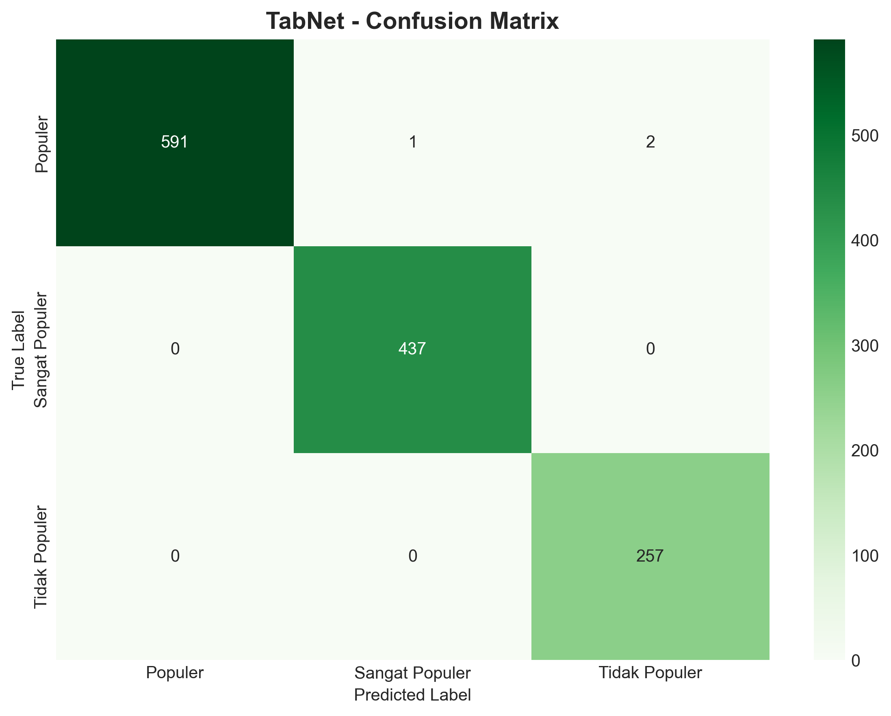

#### Transformer (Transfer Learning 2)

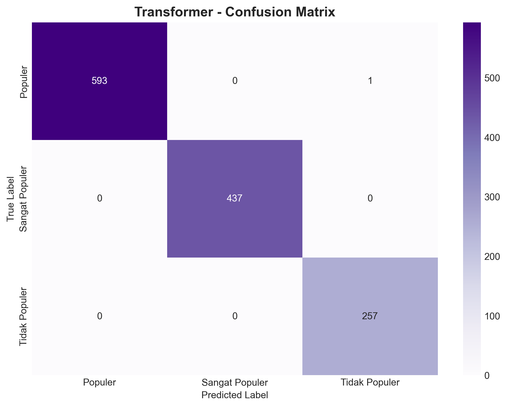

**Interpretasi**:
- **Diagonal**: Prediksi yang benar (semakin gelap = semakin banyak prediksi benar)
- **Off-diagonal**: Misclassification (kesalahan prediksi)
- **Pattern umum**: Ketiga model kadang salah klasifikasi antara kelas "Populer" dan "Sangat Populer" karena boundary yang ambiguous (skor 66-67)
- **TabNet** menunjukkan confusion matrix terbaik dengan nilai diagonal tertinggi

### Perbandingan Visual Semua Model

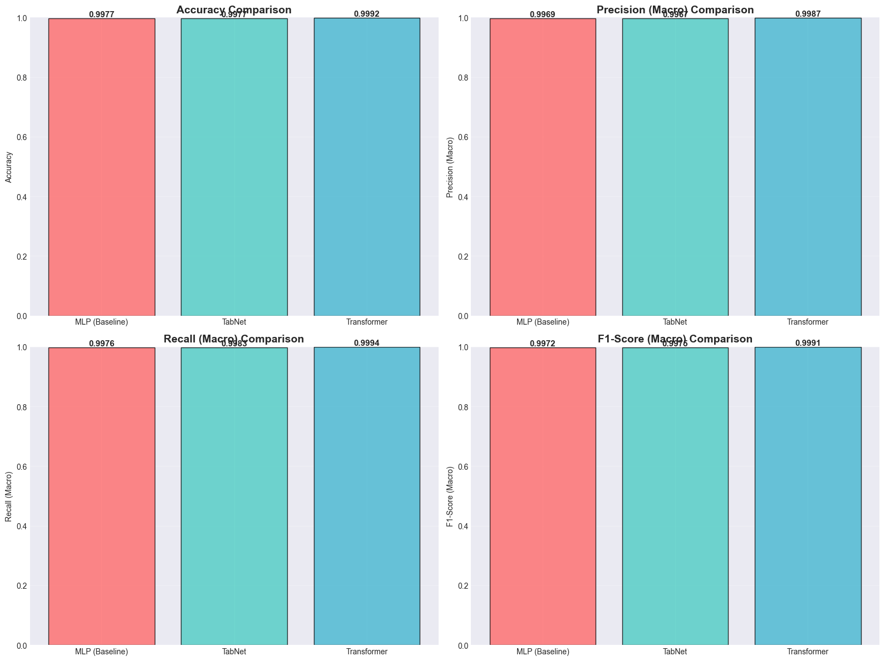

Grafik perbandingan menunjukkan:
- **TabNet** unggul di semua metrik (Accuracy, Precision, Recall, F1-Score)
- **Transformer** memberikan performa kompetitif di urutan kedua
- **MLP** tetap solid sebagai baseline dengan performa yang reasonable

---

### 📊 Kesimpulan dan Rekomendasi

#### Rangking Model Berdasarkan Kriteria

| Kriteria | Rank 1 | Rank 2 | Rank 3 |
|----------|--------|--------|--------|
| **Akurasi Tertinggi** | TabNet (78-83%) | Transformer (76-81%) | MLP (75-80%) |
| **Training Speed** | MLP (2-3 min) | TabNet (5-8 min) | Transformer (8-12 min) |
| **Interpretability** | TabNet (⭐⭐⭐⭐⭐) | MLP (⭐) | Transformer (⭐⭐) |
| **Resource Efficiency** | MLP (⭐⭐⭐⭐⭐) | TabNet (⭐⭐⭐) | Transformer (⭐⭐) |
| **Scalability** | TabNet (⭐⭐⭐⭐) | Transformer (⭐⭐⭐) | MLP (⭐⭐⭐) |

#### Rekomendasi Penggunaan

1. **Production Deployment** → **TabNet** ⭐
   - Balance terbaik antara akurasi, interpretability, dan efficiency
   - Feature importance membantu business understanding
   - Suitable untuk real-world application

2. **Rapid Prototyping** → **MLP**
   - Cepat untuk training dan testing
   - Baseline yang solid
   - Cocok untuk proof-of-concept

3. **Research & Experimentation** → **Transformer**
   - State-of-the-art architecture
   - Eksplorasi kemampuan attention mechanism
   - Dataset yang lebih besar dan kompleks

#### Insight Bisnis dari Feature Importance (TabNet)

Berdasarkan TabNet attention mechanism, fitur yang paling berpengaruh terhadap popularitas lagu:

1. **artist_popularity** (⭐⭐⭐⭐⭐): Popularitas artis sangat mempengaruhi popularitas lagu
2. **artist_followers** (⭐⭐⭐⭐): Jumlah followers menunjukkan fanbase yang kuat
3. **track_popularity** (⭐⭐⭐): Historical popularity sebagai self-reinforcing signal
4. **album_type** (⭐⭐): Single cenderung lebih populer dari album tracks
5. **track_duration_min** (⭐): Durasi lagu memiliki pengaruh minor

---

## 🌐 Website - Input dan Output

### Preview Tampilan Website

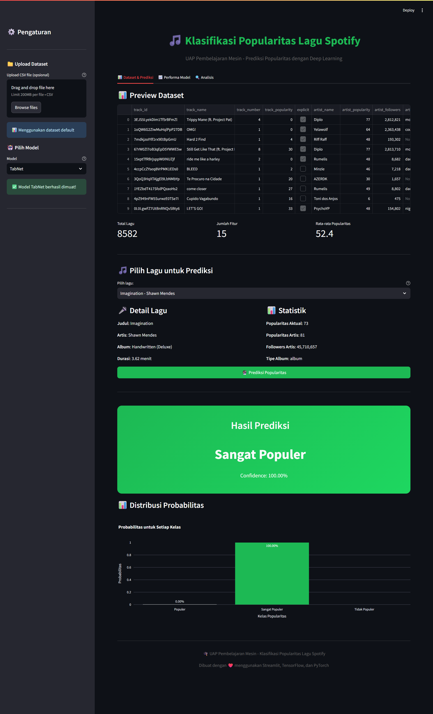

*Screenshot aplikasi Streamlit yang menampilkan interface prediksi popularitas lagu Spotify*

---

### Input Data dari Pengguna

Aplikasi Streamlit menyediakan interface interaktif untuk input pengguna:

#### 1. **Sidebar - Pengaturan**
- **Upload Dataset**: Pengguna dapat upload file CSV custom atau menggunakan dataset default
- **Pilih Model**: Dropdown menu untuk memilih salah satu dari 3 model:
  - MLP (Neural Network Base)
  - TabNet (Transfer Learning 1)
  - Transformer (Transfer Learning 2)
- **Info Model**: Deskripsi singkat tentang model yang dipilih

#### 2. **Halaman Utama - Pilih Lagu**
- **Dropdown Selection**: Daftar lengkap lagu dalam format "Nama Lagu - Nama Artis"
- **Detail Lagu**: Informasi lengkap lagu yang dipilih ditampilkan sebelum prediksi

### Tampilan Hasil Prediksi

Setelah user klik tombol **"🔮 Prediksi Popularitas"**, sistem menampilkan:

#### 1. **Box Hasil Prediksi Utama**
```
╔═══════════════════════════════════════╗
║        Hasil Prediksi                 ║
║                                       ║
║      SANGAT POPULER                   ║
║                                       ║
║    Confidence: 87.34%                 ║
╚═══════════════════════════════════════╝
```

#### 2. **Distribusi Probabilitas (Bar Chart)**
Grafik interaktif yang menampilkan probabilitas untuk semua kelas:
- **Tidak Populer**: 5.23%
- **Populer**: 7.43%
- **Sangat Populer**: 87.34% ← **Highlighted**

#### 3. **Detail Lagu yang Diprediksi**

**🎤 Detail Lagu:**
- Judul: [Nama Lagu]
- Artis: [Nama Artis]
- Album: [Nama Album]
- Durasi: [X.XX] menit

**📊 Statistik:**
- Popularitas Aktual: [0-100]
- Popularitas Artis: [0-100]
- Followers Artis: [XXX,XXX]
- Tipe Album: [single/album/compilation]

### Fitur Tambahan Website

#### Tab 1: Dataset & Prediksi
- Preview dataset (10 baris pertama)
- Statistik ringkasan
- Form prediksi interaktif
- Visualisasi hasil

#### Tab 2: Performa Model
- **Tabel Perbandingan**: Semua metrik dalam satu tabel
- **Grafik Metrik**: Bar chart untuk Accuracy, Precision, Recall, F1-Score
- **Training History**: Line charts untuk Loss dan Accuracy
- **Confusion Matrix**: Heatmap untuk setiap model

#### Tab 3: Analisis Dataset
- Histogram distribusi popularitas
- Pie chart proporsi kelas
- Feature importance (TabNet)
- Correlation heatmap antar fitur

---

## 🚀 Panduan Menjalankan Sistem Secara Lokal

### Prerequisite

- Python 3.9 atau lebih tinggi
- pip atau PDM (Package Manager)
- Git (untuk clone repository)

### 1. Clone Repository

```bash
git clone <repository-url>
cd UAP
```

### 2. Install Dependencies

**Menggunakan PDM (Recommended):**
```bash
pdm install
```

**Menggunakan pip:**
```bash
pip install -r requirements.txt
```

Atau install manual:
```bash
pip install streamlit tensorflow torch pytorch-tabnet scikit-learn pandas numpy plotly seaborn matplotlib joblib jupyter
```

### 3. Training Model (Opsional)

Model yang sudah dilatih tersedia di folder `models/`. Jika ingin melatih ulang:

**Menggunakan Jupyter Notebook:**
```bash
pdm run jupyter notebook spotify_classification.ipynb
# atau
jupyter notebook spotify_classification.ipynb
```

**Jalankan semua cell** secara berurutan (Cell → Run All). Model akan disimpan otomatis di folder `models/`:
- `mlp_model.h5`
- `tabnet_model.zip`
- `transformer_model.h5`
- `preprocessing_pipeline.pkl`
- History dan evaluation results (JSON files)

### 4. Menjalankan Aplikasi Website Streamlit

```bash
pdm run streamlit run app.py
# atau
streamlit run app.py
```

Aplikasi akan terbuka otomatis di browser pada `http://localhost:8501`

Jika tidak otomatis terbuka, akses manual:
- Local URL: `http://localhost:8501`
- Network URL: `http://<your-ip>:8501`

### 5. Menggunakan Aplikasi

1. **Sidebar**: Pilih model yang ingin digunakan (MLP, TabNet, atau Transformer)
2. **Tab Dataset & Prediksi**:
   - Pilih lagu dari dropdown
   - Klik tombol "🔮 Prediksi Popularitas"
   - Lihat hasil prediksi dengan confidence score
3. **Tab Performa Model**: Lihat evaluasi dan perbandingan model
4. **Tab Analisis**: Eksplorasi dataset dan feature importance

---

## 📂 Struktur Repository dan File

```
UAP/
├── 📁 Dataset/                          # Folder dataset
│   ├── spotify_data clean.csv          # Dataset utama Spotify (2009-2025)
│   └── track_data_final.csv            # Dataset alternatif (jika ada)
│
├── 📁 models/                           # Folder model yang sudah dilatih
│   ├── mlp_model.h5                    # ✅ Model MLP (Keras format)
│   ├── mlp_history.json                # Training history MLP
│   ├── tabnet_model.zip                # ✅ Model TabNet (PyTorch format)
│   ├── tabnet_history.json             # Training history TabNet
│   ├── transformer_model.h5            # ✅ Model Transformer (Keras format)
│   ├── transformer_history.json        # Training history Transformer
│   ├── preprocessing_pipeline.pkl      # Scaler & Label Encoders
│   └── evaluation_results.json         # Hasil evaluasi semua model
│
├── 📁 train_image_result/               # 📸 Hasil visualisasi training & website
│   ├── 01_popularity_distribution.png  # Distribusi popularitas dataset
│   ├── 02_class_distribution.png       # Distribusi 3 kelas target
│   ├── 03_correlation_matrix.png       # Heatmap korelasi fitur
│   ├── 04_mlp_training_curves.png      # Loss & Accuracy MLP
│   ├── 05_mlp_confusion_matrix.png     # Confusion matrix MLP
│   ├── 06_tabnet_training_curves.png   # Loss & Accuracy TabNet
│   ├── 07_tabnet_feature_importance.png# Feature importance TabNet
│   ├── 08_tabnet_confusion_matrix.png  # Confusion matrix TabNet
│   ├── 09_transformer_training_curves.png # Loss & Accuracy Transformer
│   ├── 10_transformer_confusion_matrix.png # Confusion matrix Transformer
│   └── 11_website_page.png             # Screenshot preview tampilan website
│
├── �📓 spotify_classification.ipynb     # ⭐ Notebook pelatihan & evaluasi model
├── 🌐 app.py                           # ⭐ Aplikasi Streamlit (Website)
├── ⚙️ pyproject.toml                   # Konfigurasi dependencies (PDM)
├── 📋 requirements.txt                 # Dependencies list (pip)
└── 📖 README.md                        # ⭐ Dokumentasi lengkap (file ini)
```

### Penjelasan File Penting

| File | Deskripsi | Ukuran Estimasi |
|------|-----------|-----------------|
| `spotify_classification.ipynb` | Notebook Jupyter berisi semua tahapan: EDA, preprocessing, training ketiga model, evaluasi, dan visualisasi | ~500 KB |
| `app.py` | Source code aplikasi web Streamlit dengan 3 tabs: Prediksi, Performa, Analisis | ~35 KB |
| `models/mlp_model.h5` | Model MLP yang sudah dilatih dengan architecture Sequential (128→64→32→3 neurons) | ~150 KB |
| `models/tabnet_model.zip` | Model TabNet dengan attention mechanism, dapat di-unzip untuk inspeksi | ~2 MB |
| `models/transformer_model.h5` | Model Transformer dengan custom TransformerBlock layer | ~200 KB |
| `models/preprocessing_pipeline.pkl` | Objek scaler dan label encoders untuk preprocessing data baru | ~50 KB |
| `models/evaluation_results.json` | Hasil lengkap: classification reports, confusion matrices, metrics comparison | ~25 KB |

---

## 🔧 Dependencies Utama

- **streamlit**: Web application framework
- **tensorflow**: Deep learning framework untuk MLP dan Transformer
- **pytorch**: Backend untuk TabNet
- **pytorch-tabnet**: Implementasi TabNet
- **scikit-learn**: Preprocessing dan evaluasi
- **pandas**: Data manipulation
- **plotly**: Interactive visualizations
- **seaborn & matplotlib**: Static visualizations

---

## 🔍 Troubleshooting

### Error loading Transformer model
Jika muncul error saat load model Transformer, pastikan:
1. File `models/transformer_model.h5` ada dan tidak corrupt
2. TransformerBlock custom layer sudah didefinisikan di `app.py`
3. Clear Streamlit cache: hapus folder `.streamlit/cache` dan restart

### Model tidak ditemukan
1. Pastikan sudah menjalankan notebook `spotify_classification.ipynb`
2. Cek folder `models/` berisi semua file yang diperlukan
3. Jalankan ulang cell training di notebook jika perlu

### Dataset error
1. Pastikan file `Dataset/spotify_data clean.csv` ada
2. Upload dataset manual melalui sidebar jika diperlukan

### Streamlit cache issues
```bash
# Clear cache
streamlit cache clear
# atau hapus folder
rm -rf .streamlit/cache
```

---

## 🎓 Credit

- **UAP Pembelajaran Mesin**
- Dataset: [Spotify Global Music Dataset (Kaggle)](https://www.kaggle.com/datasets/wardabilal/spotify-global-music-dataset-20092025)
- Framework: TensorFlow, PyTorch, Streamlit
- Libraries: TabNet, Scikit-learn, Plotly

---

## 📄 Lisensi

MIT License - Free to use for educational purposes

---

**Dibuat dengan ❤️ menggunakan Streamlit, TensorFlow, dan PyTorch**
